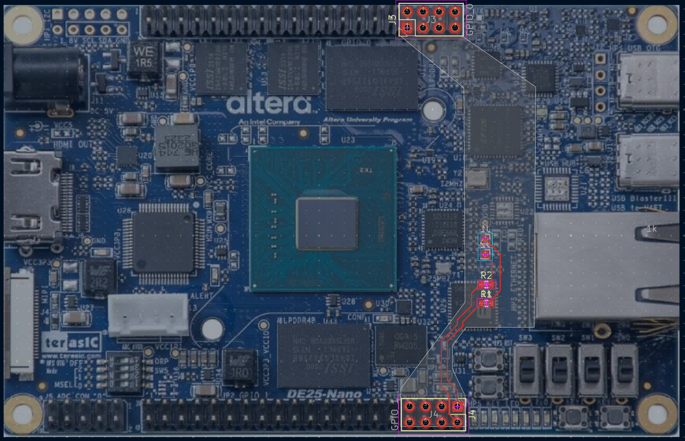
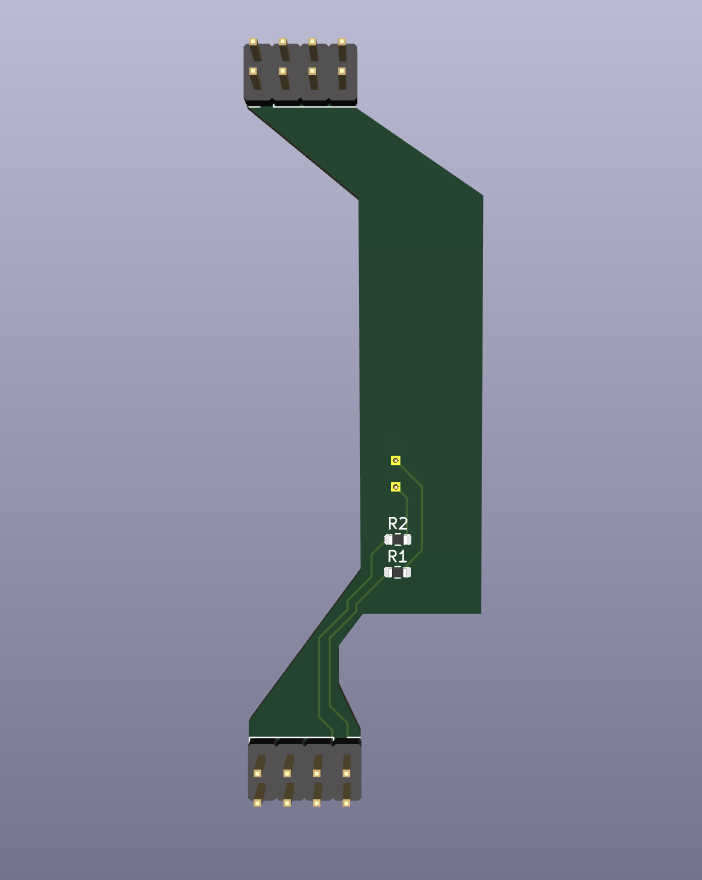
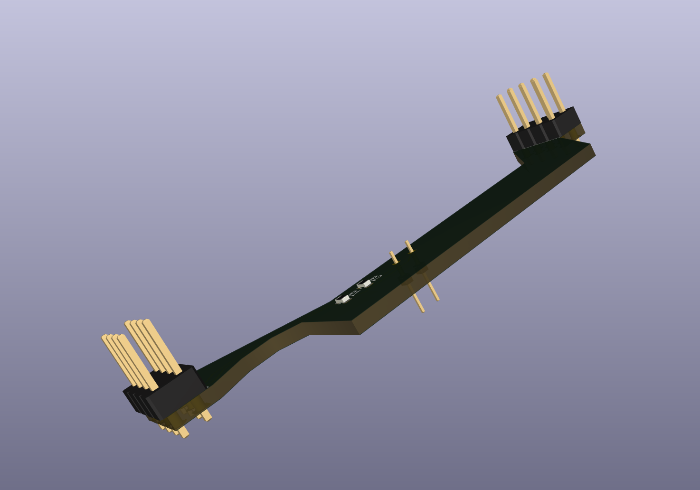

# DE25-Nano Si5332B I2C bridge

This directory contains the passive adapter PCB used to connect the DE25-Nano
Si5332B clock generator's U24 SDA and SCL test pads to FPGA GPIO 1. The board
spans GPIO 0 and GPIO 1 for mechanical alignment, while only two GPIO 1 pins
are electrically connected.

## Electrical mapping

| Signal | Bridge path | FPGA ball |
| --- | --- | --- |
| SDA | GPIO 1 connector J4 pin 1, R1 1 kOhm, SDA connector J1 | `BV14` |
| SCL | GPIO 1 connector J4 pin 2, R2 1 kOhm, SCL connector J2 | `CG26` |

The GPIO 0 connector J3 has no electrical connections. It is retained only to
locate and support the adapter. The bridge does not route power or ground and
does not add pull-up resistors. It relies on the DE25-Nano's common ground and
the existing 3.3 V I2C pull-ups. FPGA firmware must therefore use open-drain
behavior and must never actively drive SDA or SCL high.

Platform V2 keeps clock-generator writes disabled until a complete profile for
the detected Si5332 variant has been validated. The bridge does not change that
safety boundary.

## Files

- `source/`: KiCad 10 schematic, PCB, and project source.
- `gerbers/`: the supplied copper, mask, paste, silkscreen, outline, and Gerber
  job exports.
- `images/`: top, perspective, and installed-placement reference images.

The original project filenames contain the spelling `brdige`; they are retained
unchanged so the KiCad project continues to open without relinking its files.

## Manufacturing note

The supplied Gerber set does not contain an Excellon drill file, although the
design uses through-hole headers. Treat these Gerbers as reference exports.
Before ordering a PCB, open the source project in KiCad 10, run ERC and DRC,
regenerate the full fabrication package including plated drill data, and verify
the connector orientation against the installed-placement image.

